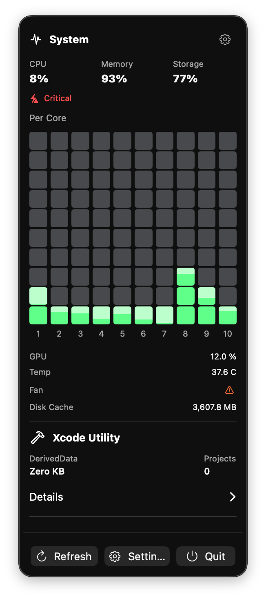
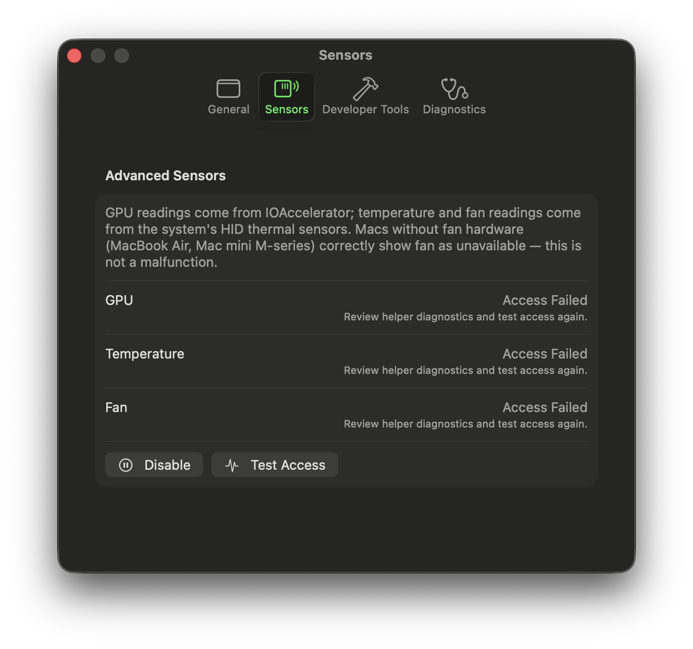

# XTop

**XTop** is a powerful and lightweight macOS menu bar application designed for developers and power users who need instant access to system telemetry and context-aware developer information.

It lives in your menu bar, providing real-time insights into your system's performance and, for developers, information about your current Xcode environment.

## Features

- **Real-time System Monitoring:** Keep an eye on key system metrics directly from your menu bar.
- **Developer-Focused Telemetry:** Integrates with your development environment to show relevant project information (e.g., current Git context, focused Xcode project).
- **Elegant Menu Bar Interface:** A clean, unobtrusive panel that gives you data when you need it without getting in your way.
- **Customizable:** Configure what you want to see through the app's settings.

## Screenshots

| Menu Bar Panel | Settings — Sensors |
|---|---|
|  |  |

## Getting Started

### Prerequisites

- macOS
- Xcode

### Building and Running

1.  Clone the repository:
    ```sh
    git clone https://github.com/your-username/XTop.git
    cd XTop
    ```
2.  Open the project in Xcode:
    ```sh
    open XTop.xcodeproj
    ```
3.  Select the `XTop` scheme and your Mac as the run destination.
4.  Press **Cmd+R** to build and run the application.

## How to Use

Once running, the XTop icon will appear in your macOS menu bar. Click it to open the main panel and view your system and developer telemetry. You can access preferences from the panel to customize the display.
